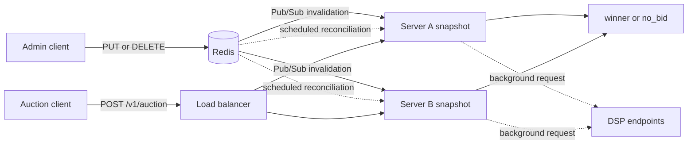

# Architecture

The service separates auction traffic from shared state changes. Auction requests use local memory. Redis coordinates bid changes between servers.

## System map

## Request paths

| Path | Shared work | Request-time work |
| --- | --- | --- |
| Bid mutation | Validate and change Redis state. | Wait for Redis. |
| Snapshot refresh | Read one placement from Redis. | Run outside the auction path. |
| Auction | None. | Read local snapshots and rank bids. |
| DSP refresh | Call configured HTTP endpoints. | Run after the auction lookup. |

### Bid mutation path

1. An admin sends a bid with a positive revision.
2. The server validates the bid and the path ID.
3. A Lua script compares the revision with the stored revision.
4. Redis changes the active bid and revision in one operation.
5. Redis publishes the placement ID.
6. Each server refreshes its local placement snapshot.

An exact retry with the same payload succeeds. Redis rejects an older revision.

A delete removes the active bid and keeps the revision. This tombstone prevents an old upsert from restoring the bid.

### Auction path

1. The server validates the JSON body.
2. The server reads the placement snapshot from an atomic pointer.
3. The server reads fresh DSP bids from a local cache.
4. The server ranks all eligible bids.
5. The server returns a winner or `no_bid`.

The auction path does not call Redis or a DSP. It does not write a log record to a network service.

The decision logger uses a bounded local queue. Queue overflow increments a metric and does not delay the auction.

### DSP refresh path

The server reads the DSP cache before it starts a refresh. A fresh cache entry prevents another refresh.

A missing entry starts one background refresh for that cache key. The cache key contains placement, country, device, and request floor.

The engine sends no user ID. It limits active refreshes and calls to each bidder.

Each HTTP request has a deadline. A circuit breaker stops calls after repeated failures.

The engine accepts a maximum response size of 64 KiB. It rejects unknown JSON fields and trailing JSON data.

DSP bids use open-market priority. The sanitizer removes revisions, deal IDs, and private-deal priorities.

## Redis keys

`REDIS_PREFIX` defaults to `adserver`.

| Key | Type | Purpose |
| --- | --- | --- |
| `{prefix}:active:{placement_id}` | Hash | Store active bid JSON by bid ID. |
| `{prefix}:active-version:{placement_id}` | Hash | Store revisions and delete tombstones. |
| `{prefix}:placements` | Set | List placements for warmup and reconciliation. |
| `{prefix}:bid-events` | Pub/Sub | Publish placement invalidations. |

The two placement hashes use the same Redis Cluster hash tag. Redis can run their Lua update in one cluster slot.

The writer adds the placement to the index before publication. A server can then repair a missed event during reconciliation.

## Auction ranking

The auction uses one policy for the life of the process.

1. Check the active time window.
2. Check country and device targeting.
3. Calculate effective CPM with integer arithmetic.
4. Check the bid floor and request floor.
5. Select the highest priority.
6. Select the highest effective CPM in that priority.
7. Select the smallest bid ID for an equal effective CPM.

First-price clearing uses the winner's effective CPM.

Second-price clearing uses the next bid in the winner's priority. The lower-priority bids do not change that price.

The server adds `SECOND_PRICE_INCREMENT_MICROS` and applies the request floor. The clearing price cannot exceed the winner's effective CPM.

## Snapshot state

Each placement snapshot contains the successful refresh time.

| State | Auction result | Repair action |
| --- | --- | --- |
| Missing | Return `cold_cache`. | Start a background refresh. |
| Fresh | Rank the cached bids. | None. |
| Stale with `serve_stale` | Rank the cached bids and set `served_stale`. | Start a background refresh. |
| Stale with `no_bid` | Return `stale_snapshot`. | Start a background refresh. |

`CACHE_REFRESH_INTERVAL` controls reconciliation. `MAX_SNAPSHOT_AGE` controls when the server marks a snapshot as stale.

## Failure behavior

| Failure | Auction behavior | Operational signal |
| --- | --- | --- |
| Redis outage | Serve a valid warm snapshot. | Readiness and cache failure metrics change. |
| Missed invalidation | Serve the current snapshot. | Reconciliation refreshes the placement. |
| Old mutation | Keep the current state. | Return HTTP `409 Conflict`. |
| DSP timeout | Use Redis bids or cached DSP bids. | Increment the timeout metric. |
| Open DSP circuit | Skip the DSP call. | Increment the circuit metric. |
| DSP refresh limit | Skip the new refresh. | Increment the refresh-limit metric. |
| Full DSP cache | Do not add a new key. | Increment the cache-full metric. |
| Full decision queue | Return the auction result. | Increment the dropped-log metric. |

## Process boundaries

This service owns active bid distribution, targeting, ranking, and clearing prices.

Separate systems must own budget debits, spend pacing, frequency caps, attribution, billing, fraud checks, and creative review.

These systems can consume auction or impression events. They must not add network calls to the warm auction path.

## Runtime endpoints

- `/healthz` reports process health.
- `/readyz` checks Redis for control-plane readiness.
- `/metrics` exports fixed-dimension Prometheus metrics.
- `DEBUG_ADDR` enables pprof on a separate listener.

Keep the pprof listener on a private interface.
